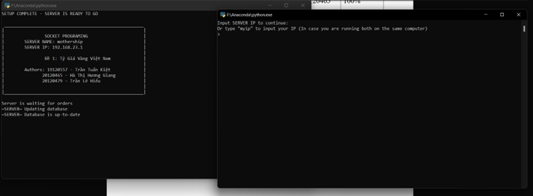
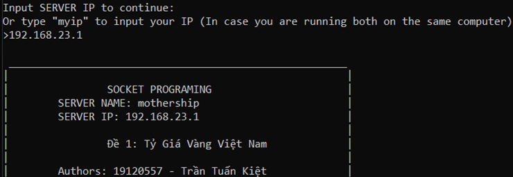
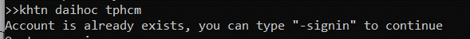

# GOLD RATE IN VIETNAM - SOCKET PROGRAMMING WITH PYTHON

---

## Description

- Create a server to store gold rate data through APIs, clients can connect to this server and get the data.
- 2^nd^-year project in _Computer Networking_ class.

---

## Table of Contents

| To-do              | Desciption                                                                                                                      |
| ------------------ | ------------------------------------------------------------------------------------------------------------------------------- |
| Connection         | TCP, many clients connect to the same server. Type correct IP server to connect                                                 |
| Connection manager | Avoid errors when user shut down the program improperly (do not let the server freeze)                                          |
| Multi-thread       | Run many program at the same time                                                                                               |
| Sign in & Sign up  | Only allows clients to use all the features of server after signning in. Notify if found any duplicated accounts when "Sign up" |
| Look up            | Read data stored in self-design database. User type _date_ and _type_ (of gold) and server will return the result               |
| Manage database    | Send _request_ and store these data in JSON file                                                                                |
| Disconnect         | Client send request to disconnect. Server can close connection to all clients                                                   |
| UI                 | Command Line Interface: Handle information send from server to client                                                           |

---

---

## How to use

#### Step 1 - Download

- Download all the files. I used Visual Studio when programming this project.
- **user_management.txt** contains created accounts, you can use these to log in, or you can create your own account at step 6.

#### Step 2 - Run the program

- On CMD, run `python server.py` and `python client.py`
- At the first time we run `python server.py`, we need to provide Firewall access.

: `server.py` to the left and `client.py`

#### Step 3 - Update database

- Server automatically request to APIs every 30 minutes only when it's online.
- Client cannot interfere this step.

: `~SERVER~ Database is up-to-date` means we got the data succesfully.

#### Step 4 - Clients connect to server

- In client CMD, type server IP to connect. In case, server and client are running on the same host, we can type `myip` and it will automatically input the IP of the host.
- `CONNECTION FAILED`: cannot found server IP, type the correct IP to process to the next step.

: Type wrong IP: `192.111.66.6`, it will took 30 seconds before showing `CONNECTION FAILED`

|        | Type the correct Server IP                                |
| ------ | --------------------------------------------------------- |
| client |                      |
| server |  |

#### Step 5 - Important keywords

`-quit`: Server will receive message then close the connection.
`-signin`: Sign in.
`-signup`: Sign up.

#### Step 6 - Sign up

- Type `-signup`:
  

- Type **username** and **password** on the same line, separate with a white space.

- Rules: **username** but **password** is not allowed to have whitespace.
- After sign up successfully, we will skip Step 7.

|        |                                      |
| ------ | ------------------------------------ |
| client |  |
| server |  |

|        | If account is exists                   |
| ------ | -------------------------------------- |
| client |  |
| server |  |

- If account is exists, type `-signin`

#### Step 7 - Sign in

- Use `-signin`, input **username** and **password** on the same line as Step 6.
  

- Type `khtn daihoc tphcm` with `khtn` is username and `daihoc tphcm` is password:

|        | **username**: `khtn` & **password**: `daihoc tphcm`           |
| ------ | ------------------------------------------------------------- |
| client |  |
| server |                 |

#### Step 8 - Look up

- Syntax: `date` + ` ` + `type`
  : _date_ (yyyy-mm-dd), _type_ - type of gold (allowed whitespace)

- Result:

|  |  |
| -------------------------------------------------- | -------------------------------------------------- |
| Result on client screen                            | Result on server screen                            |

#### Step 9 - Close connection

###### 9.1 `-quit` - send request to server

|        | Type `-quit` on **client** CMD           |
| ------ | ---------------------------------------- |
| client |  |
| server |  |

###### 9.2 Close console window

server will notify about losing connection then remove this connection completely. Client can connect again without any problem.

###### 9.3 Server close connection without asking client

Use `-quit` on server CMD _(different from step 9.1)_, this will apply on all connection.

|        | Type `-quit` on client CMD    |
| ------ | ----------------------------- |
| server |  |
| client |  |

---

For more information, please check README.MD in source code. I will explain further.
