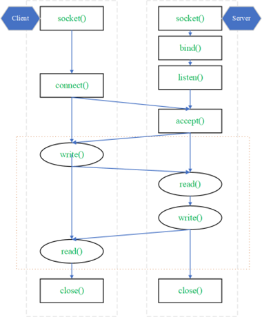

# Communication script



#### Stage 1 - _Server_ create a Socket to use service of Transport layer

```python
server = socket.socket(socket.AF_INET, socket.SOCK_STREAM)
```

`AF_INET`: address-family ipv4 (we also have AF_INET6: ipv6)
`SOCK_STREAM`: connection-oriented TCP protocol

- Assign port number: `ADDR = (SERVER, PORT)`, _Server_ will be automatically filled (so we can run on other computer) or we can get it by using:

```python
SERVER = socket.gethostbyname(socket.gethostname())
```

- Use PORT = 8888
- Every time we create a socket server, we need method `bind()`, server program will listen on available ports. That's why we need specific IP address and PORT number: `server.bind(ADDR)`
- `listen()`: _Server_ listens all connection on assigned port.

#### Stage 2 - _Client_ create socket, request a connection to _Server_

- For client, we don't necessary use `bind()` as kernel of OS will handle source IP and PORT number temporarily.
  `client.connect((SERVER_IP, PORT))`
- Instead, _Client_ use method `connect()`, which `SERVER_IP` and `PORT` are the same as server so that a conection can be established. This force user to type `SERVER_IP` correctly.
- _Server_ accept the request, a virtual communication channel is created, _Client_ and _Server_ can communicate through this channel.
  `connect, address = server.accept()`
  : `connect`: socket object to send and receive data. `address`: address of the other side

#### Stage 3: Communicate between _Client_ and _Server_

- _Server_ will always runs `get_msg()` and stop until it gets Request message from _client_:

  ```python
    def get_msg(cont)
    def send_msg(cont, text:str)
  ```

- Receive: Method `recv()` takes request message from _client_, input is number of bytes need to receive:

  ```python
  msg = cont.recv(int(msg_length)).decode('utf-8')
  ```

- Send: Method `send()` sends bytes so we need to transfer from string to bytes by. This can be used with TCP based on socket but not UDP.
  ```python
    cont.send(text.encode('utf-8'))
  ```

#### Stage 4 - End working session

- Virtual channel will be removed when _Server_ or _Client_ closes socket using `close()`. If _client_ exits without inform, _server_ will remove connection so that we can reconnect in the future.
  `cont.close()`

---

# Data structure of msg

A message has 2 parts: **header** and **data**

- No. bytes of **header** is always 64 bytes.
- No. bytes of **data** is not fixed.
- When _server_ receives message, it will read **header** to see how many bytes of **data** part, then it will read the exact No. bytes of **data**.

# Storing data

- Store account: using `.txt` file, we are not going to use 1-way hash. _username_ and _password_ are separated by a comma, each line is 1 account.
- Store gold rate data: using `Ty_gia_vang.json`. Write and read with dictionary format.

# More details about functions

|         | `verify_account(username:str, password:str)` |
| ------- | -------------------------------------------- |
| Input   | str                                          |
| Output  | bool                                         |
| Purpose | Check whether the account is exists or not   |

|         | `register(username:str, password:str)`                                                                                                     |
| ------- | ------------------------------------------------------------------------------------------------------------------------------------------ |
| Input   | str                                                                                                                                        |
| Output  | bool                                                                                                                                       |
| Purpose | Check whether the account is exists or not. If not, add new account into database and return `True`, return `False` when account is exists |

|         | `safe_split(msg, char)`                                                                                                                                                                                 |
| ------- | ------------------------------------------------------------------------------------------------------------------------------------------------------------------------------------------------------- |
| Input   | str                                                                                                                                                                                                     |
| Output  | list                                                                                                                                                                                                    |
| Purpose | An improvement of `string.split(char)`, split msg send by _client_. With appropriate input, will return a list of 2 items like **username-password** or **date-type**. Server will process on this list |


With first input, _server_ will send an error to _client_.

|         | Funtions in UI.py                                                                     |
| ------- | ------------------------------------------------------------------------------------- |
| Input   |                                                                                       |
| Output  | str                                                                                   |
| Purpose | Return Command line interface to _client_. Should not store this at client's computer |

|         | `execution_a_client(cont, addr)`                                                                                                                |
| ------- | ----------------------------------------------------------------------------------------------------------------------------------------------- |
| Input   | Connection                                                                                                                                      |
| Output  |                                                                                                                                                 |
| Purpose | Handle for each Client. Every activites between _server_ and _client_ are done in this function (also include clode connection of each _client_ |

|         | `run_server()`                                                                  |
| ------- | ------------------------------------------------------------------------------- |
| Input   |                                                                                 |
| Output  |                                                                                 |
| Purpose | Run all functions related to _server_, include create and close to all _client_ |

|         | `update_database()`                                                                                           |
| ------- | ------------------------------------------------------------------------------------------------------------- |
| Input   |                                                                                                               |
| Output  |                                                                                                               |
| Purpose | Update every 30 minutes. Each request will be overwritten on the same file, we don't store with "append" mode |

|         | remove_all_conts(cont, addr)``                                                    |
| ------- | --------------------------------------------------------------------------------- |
| Input   | Connection                                                                        |
| Output  |                                                                                   |
| Purpose | After server get command `-quit()`, remove all connection without asking _client_ |
